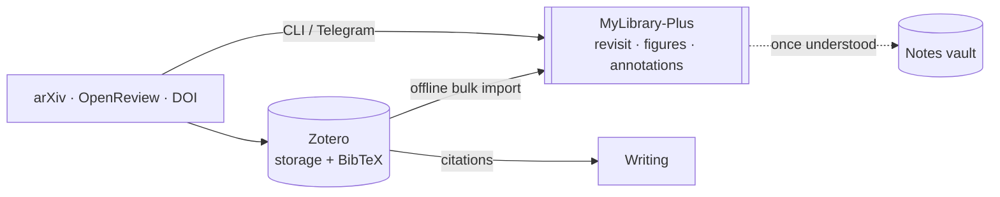
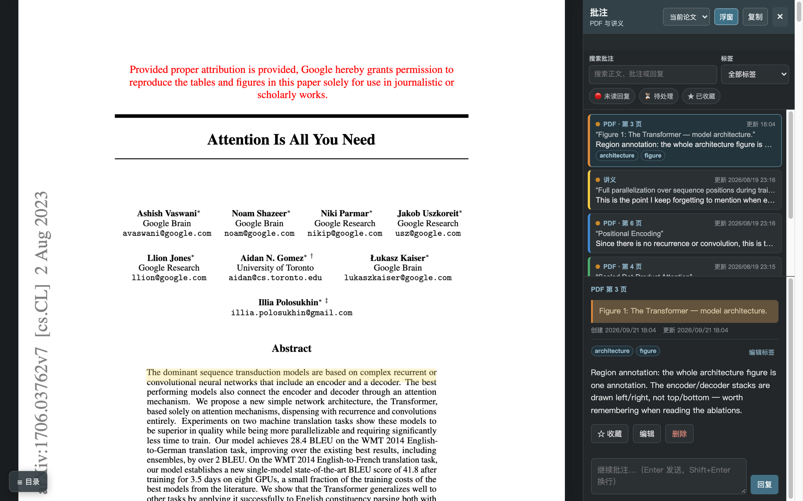
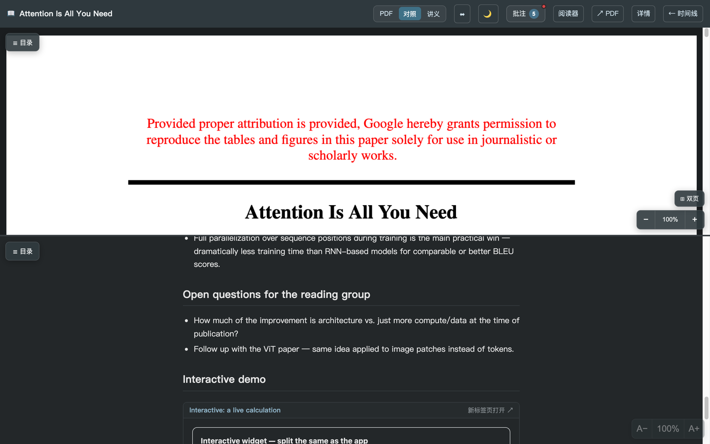
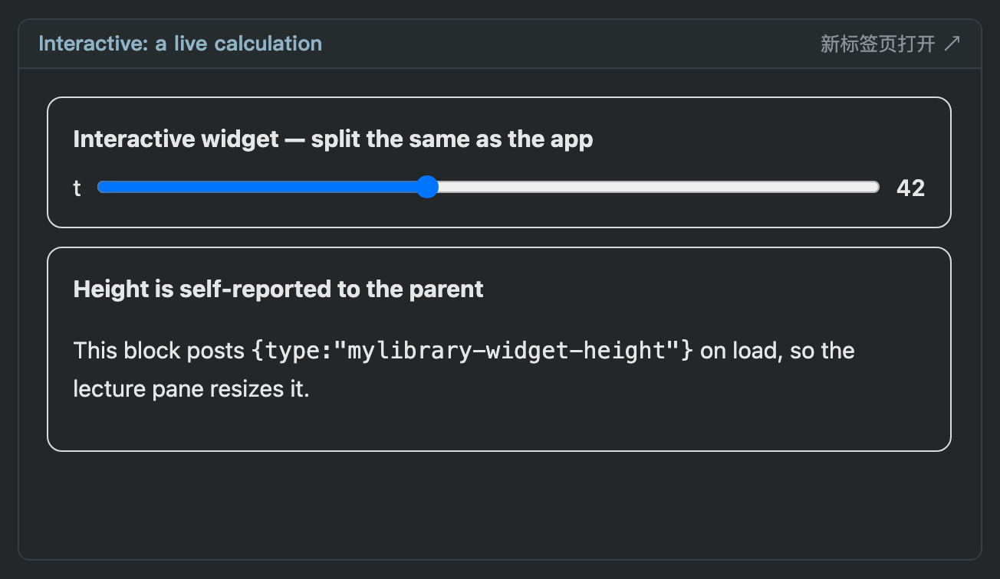
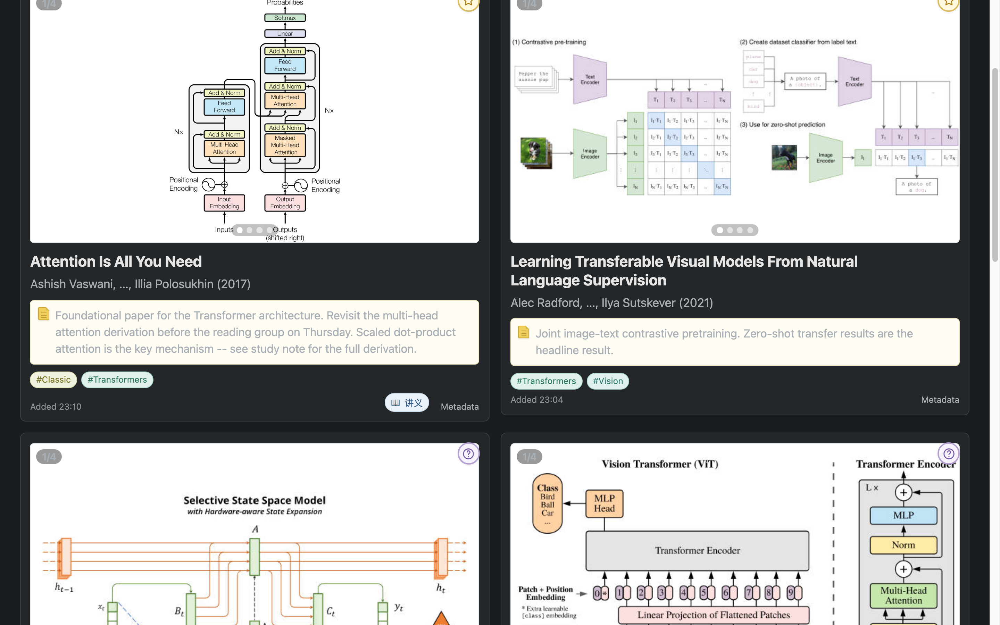
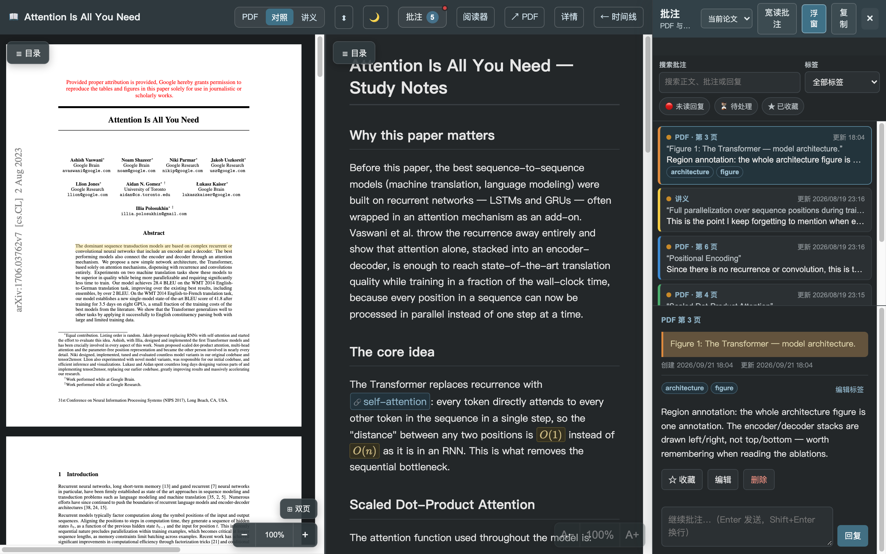

# MyLibrary-Plus

**A local-first paper library you actually come back to.**
A figure-first timeline instead of a folder tree, annotations shared between the PDF
and your own notes, and a JSON endpoint that hands a whole annotation thread to an AI
agent. No account, no cloud, no telemetry — one SQLite file and a `data/` directory.

[](https://www.python.org/)
[](LICENSE)
[](#privacy)
[](https://github.com/george-wyy/MyLibrary-Plus/actions/workflows/tests.yml)

> Fork of [liusida/MyLibrary](https://github.com/liusida/MyLibrary) with a reading and
> annotation layer added on top. See [what this fork adds](#what-this-fork-adds).


---

## The problem it solves

Reference managers are excellent at *filing* papers and terrible at *returning* to them.
Papers flow in faster than attention flows out, so the library turns into a graveyard:
you remember a figure, not a filename, and nothing in the tool is built around
running into your own saved work again.

MyLibrary-Plus sits one layer above the reference manager and optimises for the
**revisit**: the home page is a reverse-chronological timeline of paper cards showing
the *figures*, so scrolling it feels like a feed of things you once cared about.



## Highlights

| | |
|---|---|
| **Figure-first timeline** | Every card carries page 1 plus figures 1–3 in a swipeable carousel, with a full-screen lightbox. Filter by tag, by "has study notes", or search. |
| **Annotations in one place** | Select text in the PDF *or* in your Markdown study notes and annotate it. One sidebar holds both, plus a draggable floating window for reading a single thread, per-annotation tags, timestamps, edits, and replies. |
| **Study view (讲义)** | PDF on the left, your Markdown notes on the right — with KaTeX math, embedded figures, callout boxes, `[[wikilinks]]` to shared concept notes, and backlinks. A paper can carry several study notes (a primer and a chapter-by-chapter deep dive, say) behind a picker, and a note can embed its own interactive HTML/JS components in a ` ```widget ` fence. |
| **Night reading** | 夜览模式 — a system / light / dark toggle on every page, applied before first paint so there is no flash, with dark palettes across the timeline, reader, study view and annotation panels. |
| **Ready-made example library** | `examples/data/` ships a small public-paper library plus `examples/verify.py`, so a fresh clone (or an agent configuring it) can see every screen and check every route before touching real papers. |
| **Offline Zotero import** | `zotero_import.py -c "Collection"` reads Zotero's SQLite directly and reuses the PDFs already on disk, so paywalled papers keep their figures. Nothing is downloaded. |
| **Agent-ready annotations** | `GET /api/papers/{id}/annotations/context` returns the paper, its annotations and instructions as JSON; an agent replies into the thread as `role: "assistant"`. |
| **Add from anywhere** | CLI by title / URL / DOI / arXiv ID / PMID, or a private Telegram bot for adding papers from your phone. |
| **Everything stays local** | SQLite + content-addressed PDFs under `data/`. Binds to `127.0.0.1`. No account, no sync service, no analytics. |

### Reading and annotating

Select text in the PDF and write a note — or select a whole figure to annotate it as one
region. The sidebar holds every annotation for the paper — from the PDF *and* from your
study notes — with tags, timestamps, edits and replies, plus favorite / unread / waiting
for the AI filters. `复制给 AI` copies the whole thread as structured context.


The same panel takes figure regions: drag a box over a figure in the PDF and it is
stored as one annotation with its own note, tags and color.



### Study view

Your Markdown study note renders beside the PDF: KaTeX math, embedded figures,
callout boxes, and `[[wikilinks]]` into shared concept notes that show their backlinks.

A paper can have several study notes: the main one is `data/lectures/<paper_id>.md`,
and extras are `<paper_id>__<slug>.md` (`__priors`, `__chapter-3`, …), picked from a
dropdown next to the title. A note can also carry its own interactive components — put
the file under `data/lectures/assets/<paper_id>/` and point at it from a fenced block:

````markdown
```widget
src: softmax-temperature.html
height: 420
title: Interactive: softmax temperature
```
````

`study.js` renders that as an iframe on the same origin; the server only serves the
asset types on its allow-list (html/js/css/json/csv/images) from inside that paper's
asset folder, so `..` and absolute paths cannot escape it.


The split can also be stacked top/bottom when you prefer a wide PDF, and a
` ```widget ` block embeds a live component that follows the app's theme:





### Night reading (夜览模式)

One toggle cycles system → light → dark. The choice is applied before first paint, and
every surface — timeline, reader, study view, annotation panel and widgets — has a dark
palette:





### Figures, up close

Every card's carousel opens into a full-screen lightbox, so a half-remembered figure
is two clicks away.


### An in-app workflow wiki

`/wiki` renders the workflow diagrams locally with a vendored Mermaid — no network,
no CDN. Edit `templates/wiki.html` to describe your own routine.


## Quick start

```bash
git clone https://github.com/george-wyy/MyLibrary-Plus.git
cd MyLibrary-Plus
python3 -m venv .venv
.venv/bin/pip install -e .
./mylibrary init
./mylibrary add "Attention Is All You Need"
./mylibrary run
```

Open <http://127.0.0.1:8765>. `run` serves the web UI and the daily citation updater;
`serve` runs the web UI alone.

### Try it before adding your own papers

`examples/data/` is a small ready-made library (well-known arXiv papers, tags, study
notes, concept notes and annotations) so you can see every screen without importing
anything, and so an agent can verify the install end to end:

```bash
cp -R examples/data ./data            # or: cp -R examples/data ~/.local/share/mylibrary
./mylibrary serve                     # http://127.0.0.1:8765
python3 examples/verify.py --serve    # or let it check files, db and every route
```

Delete `data/` when you want to start clean. See [examples/](examples/) for what each
sample file demonstrates and how to author your own.

## CLI

```bash
# Add by title, arXiv URL, PDF URL, DOI, arXiv ID, or PMID
./mylibrary add "Attention Is All You Need"
./mylibrary add https://arxiv.org/abs/1706.03762

./mylibrary list                       # everything, newest first
./mylibrary search "diffusion"
./mylibrary show PAPER_ID              # full metadata
./mylibrary notes PAPER_ID "One-line verdict"
./mylibrary tag add PAPER_ID Classic
./mylibrary done PAPER_ID
./mylibrary citations update           # refresh citation counts
./mylibrary thumbnails --force         # rebuild figure previews
./mylibrary doctor                     # environment check
```

Any unambiguous ID prefix works in place of a full paper ID.

## Importing an existing Zotero library

```bash
python zotero_import.py --list                        # show your collections
python zotero_import.py -c "Reading list" --dry-run   # preview
python zotero_import.py -c "Reading list" --tag inbox # import
```

Metadata comes straight from Zotero's SQLite (opened read-only), PDFs are copied from
Zotero's storage folder, and figure thumbnails are extracted locally. See
[docs/zotero-import.md](docs/zotero-import.md).

## Handing annotations to an AI agent

Annotations are not a dead end — they are structured context.

```bash
curl localhost:8765/api/papers/$PAPER_ID/annotations/context
```

```jsonc
{
  "paper": { "id": "…", "title": "…", "authors": ["…"], "year": 2017 },
  "instructions": "These are the reader's private annotations…",
  "annotations": [
    { "id": "…", "quote": "…selected text…", "body": "why this matters",
      "target": "pdf", "page": 3, "tags": ["method"], "replies": [] }
  ]
}
```

An agent continues the thread by posting back:

```bash
curl -X POST localhost:8765/api/papers/$PAPER_ID/annotations/$ID/replies \
     -H 'content-type: application/json' \
     -d '{"body": "The trick is the residual path…", "role": "assistant"}'
```

The reply shows up in the sidebar next to your own. See
[docs/ai-integration.md](docs/ai-integration.md).

## Data layout

```text
data/
├── library.sqlite3   # metadata, tags, notes, annotations, reading status
├── files/            # content-addressed PDFs (sha256)
├── thumbnails/       # page-1 and figure-1..3 previews
├── lectures/         # <paper_id>.md study notes; extras as <paper_id>__<slug>.md
│                     # + lectures/assets/<paper_id>/ for widget components
├── notes/            # <slug>.md shared concept notes ([[wikilinks]] target)
├── cache/  logs/  tmp/
```

Back up `data/` and you have backed up the library. `--data-dir PATH` points any
command at a different one.

## What this fork adds

Upstream [liusida/MyLibrary](https://github.com/liusida/MyLibrary) provides the
library core: metadata discovery, PDF download, thumbnails, tags, notes, timeline,
Telegram bot, systemd service. This fork adds the reading layer on top:

- unified annotations across PDF and Markdown study notes, with tags, timestamps,
  replies, filters and a draggable floating reading window
- figure-region annotations in the PDF reader (drag a box over a figure), not just text
- the study view: PDF + notes side by side (or stacked), KaTeX math, `[[wikilinks]]`,
  backlinks, several notes per paper behind a picker, and embeddable interactive widgets
- night reading mode (system / light / dark) applied before first paint
- figure carousel and lightbox on timeline cards, plus a "has study notes" filter
- attachments: a paper with a supplement gets a file picker in the reader and study view
- offline Zotero collection import
- the annotation-context API for external agents
- an in-app workflow wiki at `/wiki`

## Privacy

The web UI has **no authentication** and binds to `127.0.0.1` by default. Do not put it
on the open internet. To read it from a phone or tablet, use a private overlay network
or an authenticating proxy — see [docs/remote-access.md](docs/remote-access.md).

Telegram credentials, if used, live in `api_keys/` and are git-ignored.

## Development

```bash
.venv/bin/pip install -e '.[dev]'
.venv/bin/pytest -q                      # 71 tests
for t in tests/*.mjs; do node "$t"; done  # front-end unit tests
```

Documentation: [docs/](docs/) · workflow diagrams also render in-app at `/wiki`.

## A note on language

The library core, CLI and API are in English. Some UI strings in the annotation and
study modules are in Chinese (`添加批注` = add annotation, `讲义` = study notes,
`复制给 AI` = copy for AI), since this fork grew out of a Chinese-language research
workflow. Translations are welcome.

## License

MIT, inherited from upstream — see [LICENSE](LICENSE).
Vendored libraries keep their own licenses: [pdf.js](src/mylibrary/web/static/vendor/pdfjs/LICENSE),
[KaTeX](src/mylibrary/web/static/vendor/katex/LICENSE), marked, Mermaid.

中文说明见 [README.zh-CN.md](README.zh-CN.md)。
