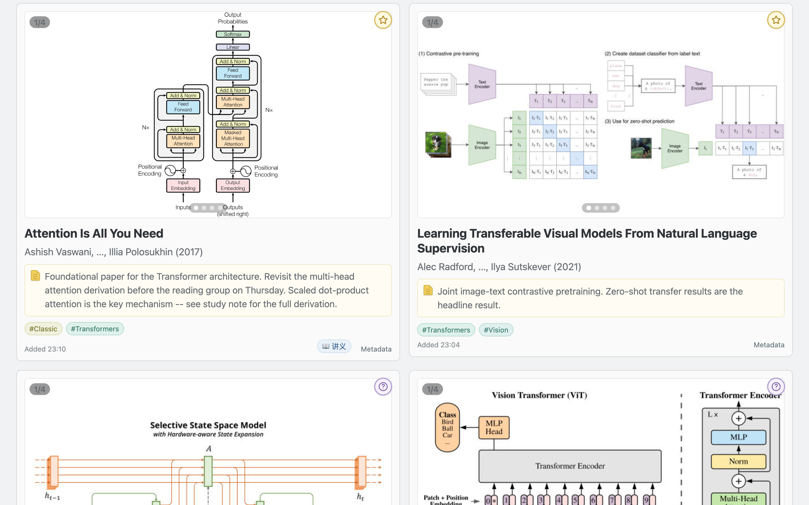
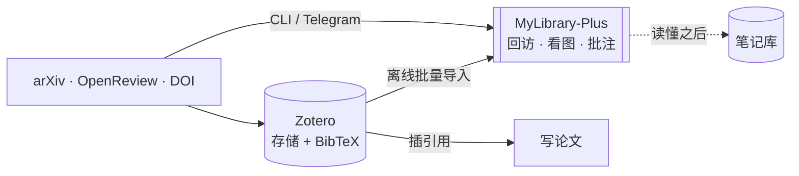
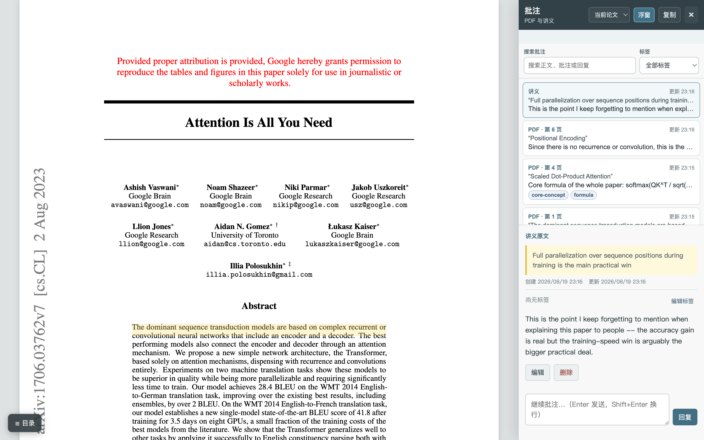
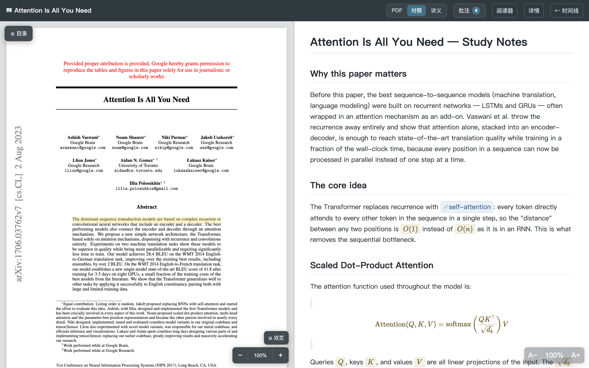
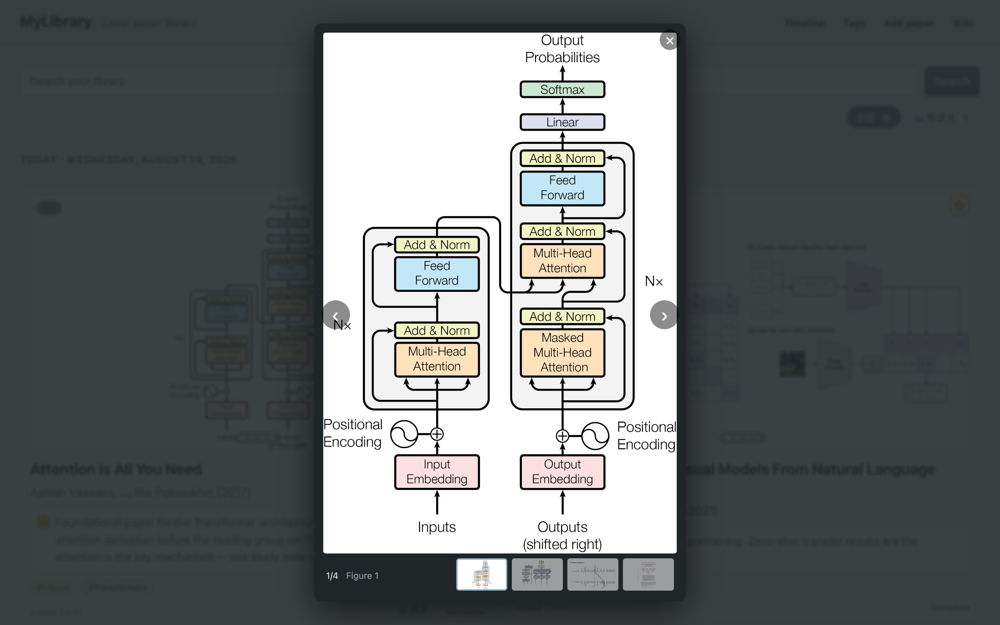
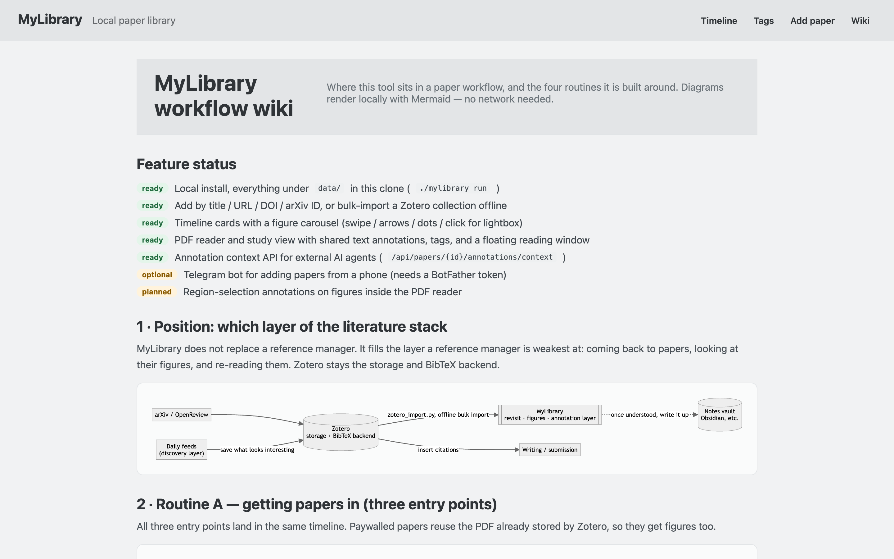

# MyLibrary-Plus

**一个你真的会回头翻的本地论文库。**
首页是按时间倒序的「图优先」时间线而不是文件夹树；批注在 PDF 和你自己的讲义之间共享；
还有一个 JSON 接口，可以把整条批注线程直接交给 AI agent。不需要账号，不上云，没有埋点——
一个 SQLite 文件加一个 `data/` 目录就是全部。

[](https://www.python.org/)
[](LICENSE)
[](#隐私与安全)
[](https://github.com/george-wyy/MyLibrary-Plus/actions/workflows/tests.yml)

> 本仓库 fork 自 [liusida/MyLibrary](https://github.com/liusida/MyLibrary)，在其之上加了一整层
> 阅读与批注功能，见[这个 fork 加了什么](#这个-fork-加了什么)。



---

## 它解决的问题

文献管理器擅长「把论文存进去」，不擅长「让你再回来看」。论文流入的速度永远快过注意力
流出的速度，于是库变成墓地：你记得的是某张图，而不是某个文件名，而工具里没有任何一处
是围绕「重新遇到自己存过的东西」设计的。

MyLibrary-Plus 站在文献管理器之上一层，专门优化**回访**：首页是按加入时间倒序的卡片
时间线，卡片正面就是论文的**图**，往下滑像刷一条自己曾经在意过的东西的信息流。



## 主要功能

| | |
|---|---|
| **图优先时间线** | 每张卡片带首页 + 图 1–3 的轮播，点开是全屏灯箱。可按标签、「有讲义」筛选，也可搜索。 |
| **批注只有一个地方** | 在 PDF 里或在 Markdown 讲义里选中文字就能批注，两者共用同一个侧栏；还有可拖动缩放的浮窗单独读一条线程，支持每条批注打标签、时间戳、编辑、回复。 |
| **讲义模式** | 左边 PDF，右边你的 Markdown 讲义——支持 KaTeX 公式、嵌图、背景知识框、`[[双链]]` 到共享概念笔记以及反向链接。一篇论文可以挂多份讲义（一份入门、一份逐章精读），在标题旁的下拉里切换；讲义里还能用 ` ```widget ` 围栏块嵌入自己的交互组件。 |
| **夜览模式** | 全站 系统 / 浅色 / 深色 三态切换，首帧之前就应用，不会闪白；时间线、阅读器、讲义模式和批注面板都有配套的深色配色。 |
| **Zotero 离线导入** | `zotero_import.py -c "分组名"` 直接读 Zotero 的 SQLite，复用本地已有的 PDF，所以付费墙论文也能抽出图。全程不联网。 |
| **给 AI 用的批注接口** | `GET /api/papers/{id}/annotations/context` 返回论文 + 批注 + 使用说明的 JSON；agent 可以用 `role: "assistant"` 把回复写回线程。 |
| **哪都能加论文** | CLI 支持标题 / URL / DOI / arXiv ID / PMID；也可以配一个私有 Telegram bot，在手机上丢链接进来。 |
| **数据全在本地** | SQLite + 内容寻址的 PDF，全在 `data/` 下；默认只绑 `127.0.0.1`。没有账号、没有同步服务、没有统计。 |

### 读与批注

在 PDF 里选中文字就能写批注——也可以框选整张图，把一块区域作为一条批注。侧栏收着这篇论文的
**所有**批注——PDF 里的和讲义里的——带标签、时间戳，可编辑、可回复，还能按「收藏 / 未读 /
等 AI 回复」筛选。`复制给 AI` 把整条线程作为结构化上下文拷走。



### 讲义模式

你的 Markdown 讲义在 PDF 旁边渲染：KaTeX 公式、嵌图、背景知识框，以及 `[[双链]]`
到共享概念笔记（并带反向链接）。

一篇论文可以有多份讲义：主讲义是 `data/lectures/<paper_id>.md`，附加讲义写成
`<paper_id>__<slug>.md`（如 `__priors`、`__chapter-3`），在标题旁的下拉里切换。
讲义还能带自己的交互组件——把文件放进 `data/lectures/assets/<paper_id>/`，用围栏块引用：

````markdown
```widget
src: dragcal-explorer.html#step=gating
height: 640
title: 交互：四道门控
```
````
`study.js` 把它渲染成同源 iframe；服务端只从该论文的资产目录里吐白名单内的类型
（html/js/css/json/csv/图片），`..` 和绝对路径都出不去。



### 看图

卡片上的轮播点开就是全屏灯箱——那张你只记得样子的图，两次点击就到。



### 应用内工作流 Wiki

`/wiki` 用内置的 Mermaid 在本地渲染工作流图，不联网、不依赖 CDN。
改 `templates/wiki.html` 就能写成你自己的流程。



## 快速开始

```bash
git clone https://github.com/george-wyy/MyLibrary-Plus.git
cd MyLibrary-Plus
python3 -m venv .venv
.venv/bin/pip install -e .
./mylibrary init
./mylibrary add "Attention Is All You Need"
./mylibrary run
```

打开 <http://127.0.0.1:8765>。`run` 会同时启动 Web 界面和每日引用数更新（配了 Telegram 就
一起起 bot）；只要 Web 界面的话用 `serve`。

## 命令行

```bash
# 标题 / arXiv 链接 / PDF 链接 / DOI / arXiv ID / PMID 都行
./mylibrary add "Attention Is All You Need"
./mylibrary add https://arxiv.org/abs/1706.03762

./mylibrary list                       # 全部，最新在前
./mylibrary search "diffusion"
./mylibrary show PAPER_ID              # 完整元数据
./mylibrary notes PAPER_ID "一句话结论"
./mylibrary tag add PAPER_ID Classic
./mylibrary done PAPER_ID
./mylibrary citations update           # 刷新引用数
./mylibrary thumbnails --force         # 重建图片预览
./mylibrary doctor                     # 环境自检
```

论文 ID 可以只写不产生歧义的前缀。

## 从 Zotero 导入

```bash
python zotero_import.py --list                        # 列出你的分组
python zotero_import.py -c "阅读清单" --dry-run       # 先预览
python zotero_import.py -c "阅读清单" --tag inbox     # 真的导入
```

元数据直接读 Zotero 的 SQLite（只读打开，不会动 Zotero），PDF 从 Zotero 的 storage 复制过来，
图在本地抽。详见 [docs/zotero-import.md](docs/zotero-import.md)。

## 把批注交给 AI

批注不是终点，它是结构化的上下文。

```bash
curl localhost:8765/api/papers/$PAPER_ID/annotations/context
```

```jsonc
{
  "paper": { "id": "…", "title": "…", "authors": ["…"], "year": 2017 },
  "instructions": "These are the reader's private annotations…",
  "annotations": [
    { "id": "…", "quote": "…被选中的原文…", "body": "为什么重要",
      "target": "pdf", "page": 3, "tags": ["method"], "replies": [] }
  ]
}
```

Agent 用下面这条把回复写回同一条线程，回复会出现在侧栏里你自己那条旁边：

```bash
curl -X POST localhost:8765/api/papers/$PAPER_ID/annotations/$ID/replies \
     -H 'content-type: application/json' \
     -d '{"body": "关键在残差路径……", "role": "assistant"}'
```

详见 [docs/ai-integration.md](docs/ai-integration.md)。

## 数据布局

```text
data/
├── library.sqlite3   # 元数据、标签、笔记、批注、阅读状态
├── files/            # 内容寻址的 PDF（sha256 命名）
├── thumbnails/       # 首页 + 图 1–3 预览
├── lectures/         # <paper_id>.md 讲义；附加讲义写成 <paper_id>__<slug>.md
│                     # + lectures/assets/<paper_id>/ 放交互组件
├── notes/            # <slug>.md 共享概念笔记（[[双链]] 的落点）
├── cache/  logs/  tmp/
```

备份 `data/` 就等于备份了整个库。任何命令都可以用 `--data-dir PATH` 指到别的目录。

## 这个 fork 加了什么

上游 [liusida/MyLibrary](https://github.com/liusida/MyLibrary) 提供了库的内核：元数据发现、
PDF 下载、缩略图、标签、笔记、时间线、Telegram bot、systemd 服务。本 fork 在上面加了阅读层：

- PDF 与 Markdown 讲义统一的批注体系：标签、时间戳、回复、筛选，以及可拖动的阅读浮窗
- PDF 阅读器里的图区批注：框选一块图作为一条批注，而不只是选文字
- 讲义模式：PDF + 讲义左右（或上下）分屏，KaTeX 公式、`[[双链]]`、反向链接；
  一篇论文可挂多份讲义，讲义里能嵌交互组件
- 夜览模式（系统 / 浅色 / 深色），首帧前生效
- 时间线卡片的图集轮播与灯箱，以及「有讲义」筛选
- 附件：带补充材料的论文在阅读器和讲义模式里有文件切换
- Zotero 分组离线导入
- 给外部 agent 用的批注上下文 API
- 应用内的工作流 wiki（`/wiki`）

## 隐私与安全

Web 界面**没有任何鉴权**，默认只绑 `127.0.0.1`。不要直接暴露到公网。想在手机 / iPad 上看，
走私有 overlay 网络（如 Tailscale）或带鉴权的反代，见
[docs/remote-access.md](docs/remote-access.md)。

Telegram 凭据放在 `api_keys/` 下，已被 git 忽略。

## 开发

```bash
.venv/bin/pip install -e '.[dev]'
.venv/bin/pytest -q                       # 71 个测试
for t in tests/*.mjs; do node "$t"; done  # 前端单元测试
```

文档在 [docs/](docs/)；同样的工作流图在应用内 `/wiki` 也能看。

## 关于界面语言

库内核、CLI 和 API 是英文的。批注与讲义模块里有一部分界面文案是中文（`添加批注`、`讲义`、
`复制给 AI`），因为这个 fork 长自一套中文科研工作流。欢迎提 PR 做英文化。

## 许可

MIT，继承自上游，见 [LICENSE](LICENSE)。内置的第三方库各自保留其许可：
[pdf.js](src/mylibrary/web/static/vendor/pdfjs/LICENSE)、
[KaTeX](src/mylibrary/web/static/vendor/katex/LICENSE)、marked、Mermaid。

English version: [README.md](README.md)
