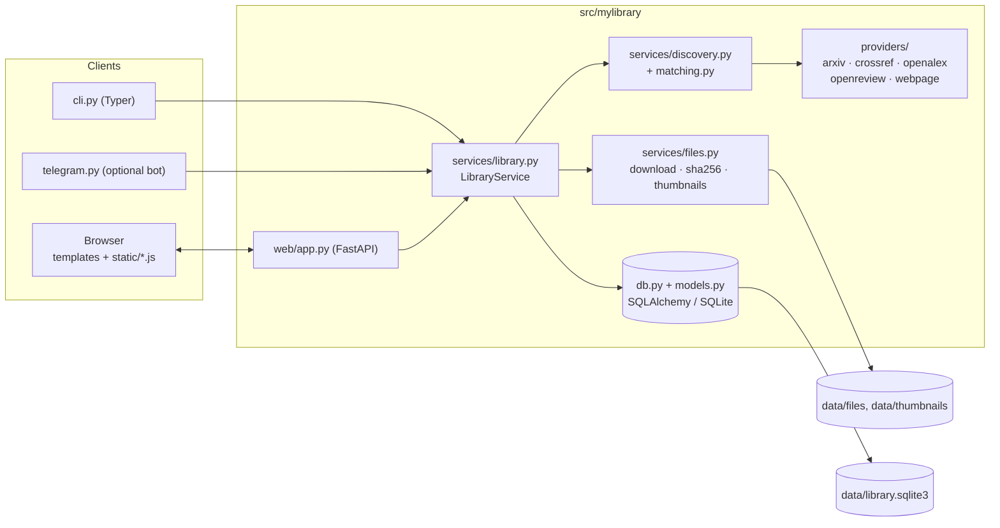
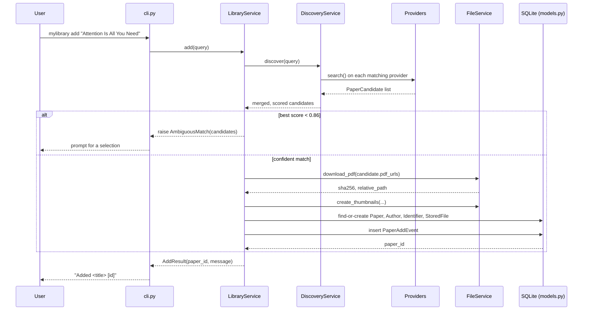

# Architecture

MyLibrary is a single Python process: a Typer CLI and a FastAPI web app share one
`LibraryService`, one SQLite database, and one content-addressed file store under
`data/`. There is no separate backend/frontend deployment — `mylibrary serve` (or
`mylibrary run`) starts uvicorn in-process and serves server-rendered Jinja2 pages
with small vanilla-JS modules layered on top.

## Package layout

| Path | Owns |
|---|---|
| `cli.py` | Typer app: add, list, search, tag, citations, service, telegram, serve/run |
| `config.py` | `Settings` dataclass — resolves `data_dir` and its subpaths |
| `db.py` | SQLAlchemy engine/session setup, lightweight in-place `ALTER TABLE` migrations |
| `models.py` | SQLAlchemy ORM models (the schema) |
| `schemas.py` | Plain dataclasses passed between providers/services (not persisted) |
| `providers/` | One metadata source per file: arxiv, crossref, openalex, openreview, webpage |
| `services/discovery.py` | Classifies a query (doi/arxiv/openreview/pmid/url/title), fans out to providers |
| `services/matching.py` | Title normalization, candidate scoring, candidate de-duplication/merging |
| `services/files.py` | PDF download, sha256 storage, thumbnail + figure-crop rendering (PyMuPDF) |
| `services/library.py` | `LibraryService` — the single entry point both `cli.py` and `web/app.py` call into |
| `services/citations.py` | Background daily citation-count refresh (OpenAlex/Semantic Scholar/Crossref) |
| `telegram.py` | Optional bot: same `LibraryService.add()` from a phone |
| `systemd.py` | Generates/installs a systemd unit for `mylibrary service ...` |
| `web/app.py` | FastAPI routes + Jinja2 templates |
| `web/templates/*.html` | Server-rendered pages |
| `web/static/*.js`, `*.mjs` | Browser-side reader/annotation/study behavior |

## Component diagram



## Request path: `mylibrary add` to a stored paper

`add` accepts a title, URL, DOI, arXiv ID, or PMID. `DiscoveryService.classify_input`
picks which providers to query, fetches candidates from each concurrently, merges
duplicates (`matching.merge_candidates`), and scores them against the query
(`matching.score_candidate`). A score below `auto_threshold` (0.86) raises
`AmbiguousMatch` so the caller can prompt for a choice instead of guessing.



The web UI's `POST /add` and `POST /add/selected` routes call the exact same
`LibraryService.add` / `add_candidate`; only the transport (form vs. CLI args) and
error rendering differ. Re-adding a paper that already exists (same DOI/arXiv ID/
identifier/normalized title) does not duplicate it — it appends a `PaperAddEvent`
timestamp instead, which is what drives the "recently added" ordering.

## Content-addressed storage, thumbnails, figures

Downloaded PDFs are hashed (SHA-256) and written to
`data/files/<sha256[:2]>/<sha256>.pdf`; two papers that share the same PDF bytes
share the same file. `zotero_import.py` copies PDFs into this same store rather than
linking Zotero's copy, so the library stays self-contained.

`FileService.create_thumbnails` (PyMuPDF/`fitz`) then renders, per PDF, into
`data/thumbnails/<sha256[:2]>/<sha256>/<source>.png`:
- `page-1.png` — the first page, always available.
- `figure-1..3.png` — best-effort crops: `_find_figure` looks for a "Figure N"
  caption on each page, then `_figure_crop` clusters nearby vector drawings/image
  blocks/labels into a bounding box above it. For arXiv papers,
  `_fetch_structured_figures` prefers the paper's HTML rendering
  (`arxiv.org/html/...`, falling back to `ar5iv.labs.arxiv.org`) and crops the
  semantic `<figure>` element instead, which is usually cleaner.

Timeline cards additionally request a `?size=card` variant — a smaller cached JPEG
(`card_variant`) — because full-resolution PNGs made a long timeline slow to load.

## Database schema (SQLAlchemy models, `models.py`)

| Table | Purpose |
|---|---|
| `papers` | One row per paper: metadata, `is_done`, `marker`, `notes`, `thumbnail_source` |
| `paper_add_events` | Timestamp per (re-)add; drives "recently added" ordering |
| `authors` / `paper_authors` | Authors shared across papers; join table carries author order |
| `identifiers` | Extra `(scheme, value)` pairs beyond the dedicated `doi`/`arxiv_id`/`pmid` columns |
| `files` (`StoredFile`) | One row per stored PDF: `relative_path`, `sha256`, `source_url` |
| `tags` / `paper_tags` | Free-form tags, shared vocabulary, many-to-many with papers |
| `citation_observations` | One row per `(paper, source)` citation-count reading |
| `annotations` | Highlights/notes on a PDF, a lecture, or a shared note (`target_type`) |
| `annotation_tags` / `annotation_replies` | Tags on an annotation; threaded replies (`role`: `user`/`assistant`) |

`db.py` adds columns with `ALTER TABLE` on startup instead of a migration tool —
fine for a single-user SQLite file, not for concurrent multi-writer use.

## Front-end module layout (`web/static/`)

| File | Owns |
|---|---|
| `app.js` | Timeline page glue: "mark done" toggle, theme toggle, small non-reader interactions |
| `pdfview.js` | pdf.js viewer shared by the reader and study view: rendering, zoom, outline/TOC, figure hotspots + region-selection annotations, PDF-anchored highlight rects, the supplemental-file picker |
| `reader.js` | Standalone `/paper/{id}/read` page: wires `PdfView` + `AnnotationPanel`, theme toggle, "download PDF and open ChatGPT" |
| `study.js` | `/paper/{id}/study` split view: PDF pane + lecture Markdown pane, lecture picker (`?variant=`), 左右/上下 layout switch, view-mode switch, notes zoom, `[[wikilink]]` popovers, ` ```widget ` iframes, lecture/note text-offset annotation anchoring |
| `annotations.js` | `AnnotationPanel` — sidebar/floating-window UI shared by reader and study view: CRUD, tags, replies, favorite/unread/pending filters, float font size, "copy AI context" |
| `annotation-colors.mjs` | The 8-color palette shared by the picker and highlight rendering |
| `annotation-interaction.mjs` | Pure hit-testing/selection helpers (which annotation a click landed on) and float-mode/font-size preferences |
| `annotation-metadata.mjs` | Tag parsing, timestamp formatting, annotation status (favorite / unread / waiting for the AI), panel-selection reconciliation |
| `annotation-form-state.mjs` | Disables/restores form controls during an in-flight save |
| `lecture-widget.mjs` | Pure parsing/validation for ` ```widget ` blocks → `{url, height, title}` |
| `theme.mjs` | The system / light / dark toggle (shared by `app.js`, `reader.js`, `study.js`) |
| `floating-window.mjs` | Generic draggable/resizable window (annotation float, wikilink popover) |
| `math-markdown.mjs` | Masks `$..$`/`$$..$$`/`\(..\)`/`\[..\]` before Marked runs, renders them with vendored KaTeX, sanitizes the resulting HTML |
| `vendor/` | Vendored third-party libs (pdf.js, marked, KaTeX, mermaid) — no CDN at runtime |

Dark mode is token-based: each stylesheet declares light values in `:root` and the
same variable names under `@media (prefers-color-scheme: dark) { :root:not([data-theme="light"]) }`
and `:root[data-theme="dark"]`, and `theme.mjs` only sets/deletes
`<html data-theme>`. Every page head carries a tiny inline script that reads
`localStorage['mylibrary-theme']` before first paint, so a dark-mode reload never
flashes white.

## Where data lives on disk

Everything is under one directory, configurable with `--data-dir` (default:
`<repo>/data`, created by `mylibrary init`):

```
data/
├── library.sqlite3        All metadata, tags, annotations, add history
├── files/<sha>[:2]/…pdf    Content-addressed PDFs
├── thumbnails/<sha>[:2]/…  page-1 / figure-1..3 (+ cached .card.jpg)
├── lectures/<paper_id>.md  Study notes for one paper (docs/study-notes.md)
│                          extra lectures: <paper_id>__<slug>.md
├── lectures/assets/<id>/   HTML/JS components embedded by a lecture's ```widget block
├── notes/<slug>.md         Shared concept notes, linked via [[wikilinks]]
├── tmp/, cache/            Scratch space; cache/ is currently unused
└── logs/                   telegram.log, citations.log
```

`data/` (and `api_keys/`, which holds the Telegram bot token) are git-ignored — a
clone ships no personal data.
